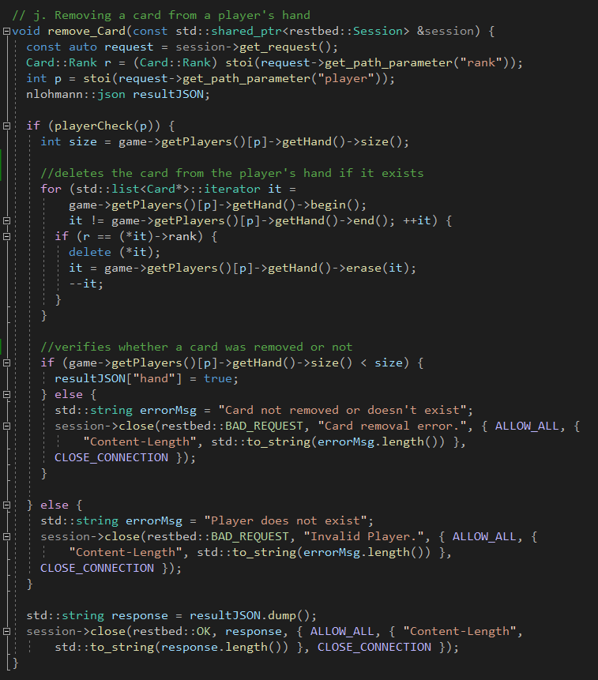
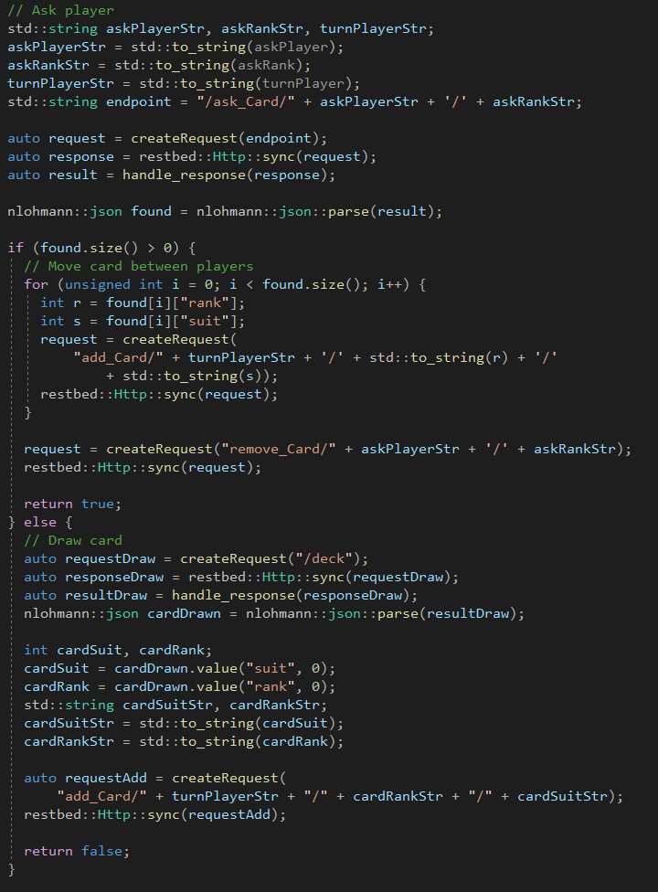
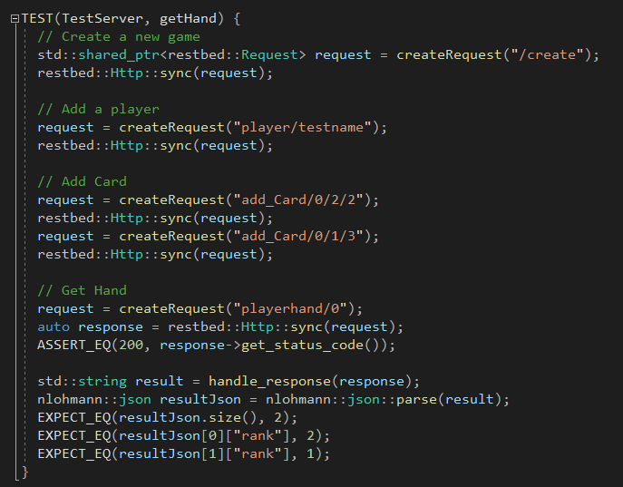
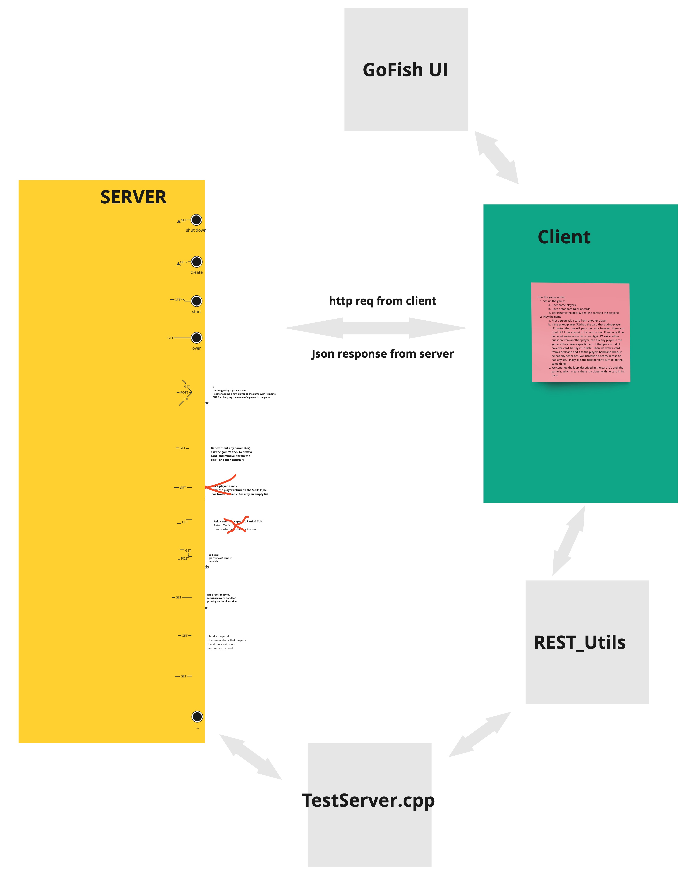

# Advanced_Software_Engineering
#RestAPI #CodeCompletion #DevOps #AspectOriented_Programming

Projected Completed During The Semester:
+ Introduction to GitLab piplelines and tools
+ Code Completion tool
+ Aspect Oriented Programming
+ RestFull API in C++
+ Soft Engineering research paper summarization

-------
## RestFull API in C++ (implementation of Go-Fish game)

In this group project, we were assigned to take an existing program that runs a game of Go Fish and adapt it into a REST API. The adaptation was implemented in C++ using Corvussoft's Restbed and Niels Lohmann's JSON libraries. The image showcases an example of one of the endpoints I developed. This particular endpoint uses a GET request to check a player's hand for a specific card and, if found, removes the card. I implemented checks to minimize errors and ensure that unnecessary code isn't executed when not needed. For instance, the `playercheck(p)` function verifies that the integer `p` falls within the valid range of players. Additionally, this endpoint highlights my familiarity with handling complex data types, such as iterators, lists, and pointers.

This is an example of how I implemented a client-side request. Specifically, it shows part of the game logic for asking a player for a card. A request is sent to the player, which returns a JSON list of the cards in their hand. If the list contains one or more cards, the program loops through it, requesting the removal of those cards from the player's hand, and then sends a request to add them to the asking player's hand. If the requested card is not in the player's hand, a request is made for the player to draw from the deck.

Here is an example of a test I wrote to verify the functionality of retrieving a player's hand. This was accomplished using Google's GTEST library, and the tests are automatically executed via the makefile when compiling the project, alongside memory leak detection, static analysis, and style checks. The test incorporates both `ASSERT` and `EXPECT` methods to ensure functionality. If the server response code isn't 200, an error occurred, making further tests irrelevant, so I used `ASSERT`. If the returned JSON is valid, I employed `EXPECT` to confirm the results are as anticipated.

Diagram of the project is as follows:

